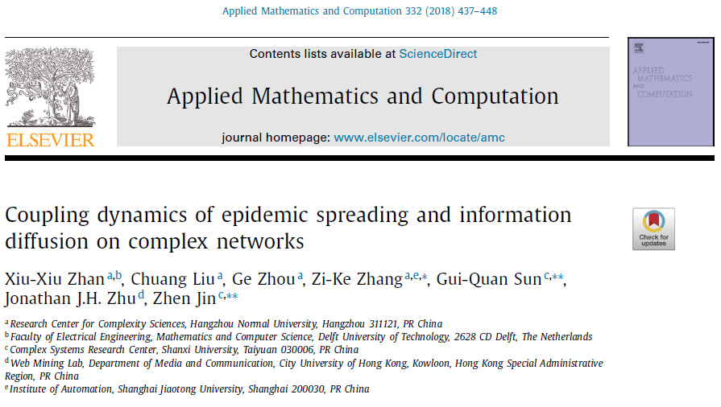

# 实验现象分析

*Zhan X X, Liu C, Zhou G, et al. Coupling dynamics of epidemic spreading and information diffusion on complex networks[J]. Applied Mathematics and Computation, 2018, 332: 437-448.*

## 网络参数

* 网络: ER_2000_00075.mat
* 度相关参数:
	- $<k> = 15.011$
	- $\lambda_c = 0.06661781360335754$

## 传播模型参数

* 设定 $\sigma_{S}=0.3$, $\sigma_{I}=0.6$, $\sigma_{F}=0.8$, $\sigma_{R}=1.5$, $\delta=0.15$ 和 $\mu=0.1$。
* 当前参数使得疾病有效传播率衰减0.12。
* loop=50, 耗时3690s(1h)

1. $\beta = 0.05$

此时下层有效感染率为$\lambda_c=0.5$, 考虑到信息传播对疾病传播的影响, 实际有效感染率会更低, 实际疾病有效传播率经过最高衰减为0.006。

 感染率曲线在上升期依然会发生剧烈震荡(loop=50)，而且曲线和原论文曲线并不完全一致。

2. $\beta = 0.2$

此时下层有效感染率为$\lambda_c=2$, 考虑到信息传播对疾病传播的影响，实际有效感染率会更低。

3. $\beta = 0.8$

此时下层有效感染率为$\lambda_c=8$, 考虑到信息传播对疾病传播的影响，实际有效感染率会更低。

4. 原论文图片

原论文采用$N=10000$, $<k>=15$的ER网络, 且进行了10000次独立实现，目前还无法得知抖动是否在进行10000次独立实现后能否消除震动。