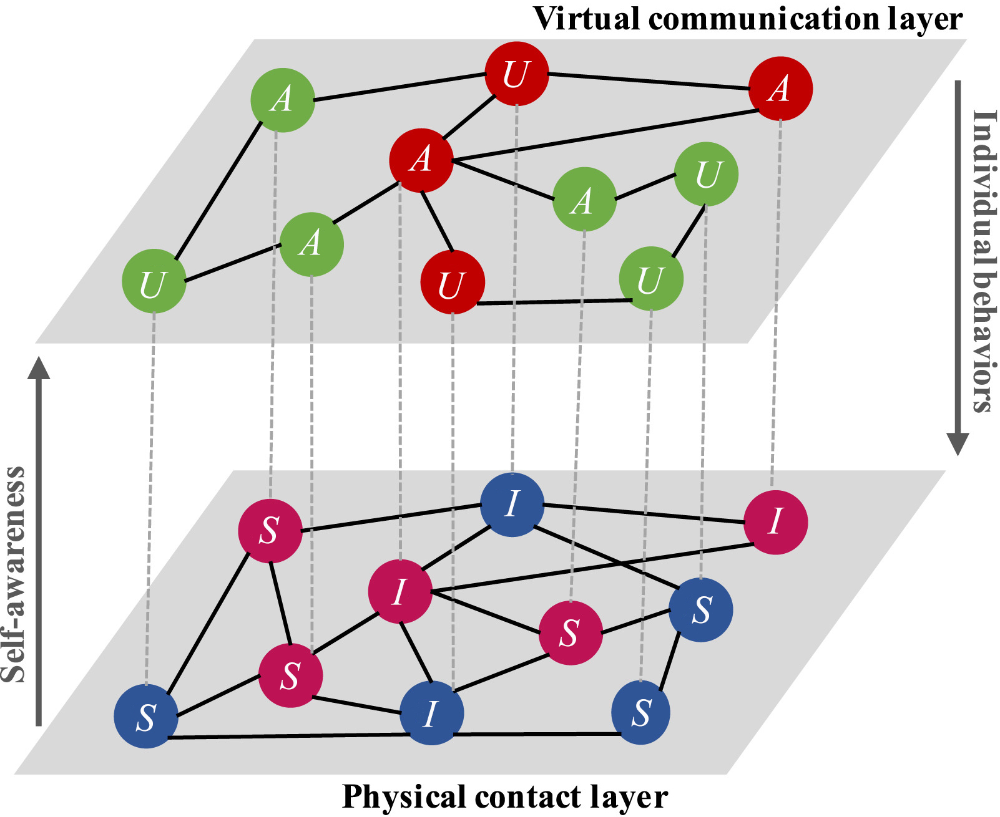
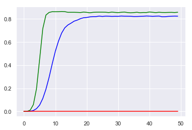
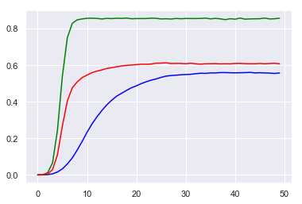
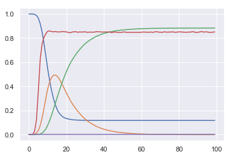
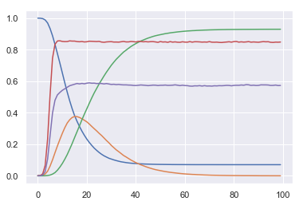

# 模型描述

## 1. 模型描述

模型地址: [multiplex_networks.m](https://github.com/Aithosa/Epidemic-Information_spreading/blob/master/Matlab/multiplex_networks.m)

### 1.1 网络模型

双层网络，节点总数为 $N=2,000$ 其中下层为BA网络, 作为接触层模拟疾病传播;  上层网络对下层的BA网络随机增加400条边, 以保证两层网络的相关性, 作为信息层模拟疾病相关信息的传播。

### 1.2 传播模型

接触层在SIS和SIR传播模型均作了模拟:

1. 下层为SIS传播模型，上层为UAU传播模型;
2. 下层为SIR传播模型，上层为UAU传播模型。

基本策略：

下层网络代表接触层，进行疾病传播, 采用SIS或SIR传播模型： 在每个时间，易感状态节点在接触了感染状态的邻居时有$\beta$ 概率被传染为感染态节点，感染状态节点以$\mu$ 的概率会康复成为易感状态节点(SIS模型)/康复成为免疫状态节点(SIR模型)；

上层网络代表信息层，进行疾病相关信息的传播，采用UAU传播模型：在每个时间，未知状态节点在接触了已知状态的邻居时有$\lambda$ 概率被传播为已知状态节点，已知状态节点以$\delta$ 的概率会遗忘信息成为未知状态节点；

交互规则：接触层感染状态节点会以$\alpha$ 的信息上传率，在每个时间变为信息层的已知状态节点，信息层的已知状态节点在接触层若是易感状态节点，其和其他节点接触时会携带$\sigma_{S}$ 的感染率衰减。

[参数描述]:

* $\beta$ 感染概率
* $\mu$ 恢复概率/免疫概率
* $\lambda$ 传播概率
* $\delta$ 遗忘概率

* $\alpha$ 信息上传率
* $\sigma_{S}$ S节点在知道信息后的防御系数/感染率衰减

### 1.3 策略描述

在每个时间：

信息层的已知状态节点都会以 ${inactiverate}$ 的概率变为接触层的不活跃节点；
信息层的未知状态节点都会以 ${activerate}$ 的概率重新变为接触层的活跃节点。

其中：

接触层的不活跃节点在进行疾病传播时只会和活跃邻居节点接触，而不会和其他不活跃邻居节点接触；
接触层活跃节点则会和所有节点接触，不管其邻居的状态时活跃还是不活跃。

[策略参数描述]:

* ${inactiverate}$ 接触层节点变为不活跃状态的概率
* ${activerate}$ 接触层节点变为活跃状态的概率

> 注：可以设置${inactiverate} + {activerate} = 1$

<!-- *表1 在传播过程中使用的参数。*

|参数           | 说明           |
| ------------- |:------------- |
| $\beta$             | $S_{-}$ 个体被 $I_{-}$ 邻居感染的概率($S_{-}I_{-} \rightarrow I_{-}I_{-}$)   |
| $\sigma_{S} \beta$  | $S_{+}$ 个体被 $I_{-}$ 邻居感染的概率($S_{+}I_{-} \rightarrow I_{+}I_{-}$)   |
| $\sigma_{I} \beta$  | $S_{-}$ 个体被 $I_{+}$ 邻居感染的概率($S_{-}I_{+} \rightarrow I_{-}I_{+}$)   |
| $\sigma_{SI} \beta$ | $S_{+}$ 个体被 $I_{+}$ 邻居感染的概率($S_{+}I_{+} \rightarrow I_{+}I_{+}$)   |
| $\mu$             | $I_{-}$ 个体康复为 $S_{-}$ 个体的概率  |
| $\sigma_{R} \mu$  | $I_{+}$ 个体康复为 $S_{+}$ 个体的概率  |
| $\lambda$               | 信息传输率  |
| $\delta$                | 信息遗忘率($S_{+} \rightarrow S_{-}$)  |
| $\sigma_{F} \delta$     | 信息遗忘率($I_{+} \rightarrow I_{-}$)  |
| $\alpha$     | 信息上传率($I_{-} \rightarrow I_{+}$)   |
| $K$          | S节点和已知信息的I节点接触后知晓信息的概率 | -->

## 2. 模拟结果

为了方便对比，本节所有模型使用的都是相同的参数。

SIS参数： 感染率 $\beta = 0.2$ , 恢复率/免疫率$\mu = 0.1$

UAU参数: 传播率$\lambda = 0.4$, 遗忘率$\delta = 0.15$

策略参数： 节点不活跃概率${inactiverate} = 0.4$, 活跃概率${activerate} = 0.6$

层间交互参数： 信息上传率$\alpha = 0.6$, 感染率衰减$\sigma_{S} = 0.7$

### 2.1 SIS-UAU

当没有加入策略时，${inactiverate} = 0$ ， ${activerate} = 1$ ，其他参数不变。

图2(图3)注： 

* 绿色曲线代表知情节点密度
* 蓝色曲线代表感染节点密度
* 红色曲线代表不活跃节点密度

加入策略的结果：

### 2.2 SIR-UAU

当没有加入策略时，${inactiverate} = 0$ ， ${activerate} = 1$ ，其他参数不变。

图4(图5)注： 

* 红色曲线代表知情节点密度
* 蓝色曲线代表易感节点密度
* 黄色曲线代表感染节点密度
* 绿色曲线代表免疫节点密度
* 紫色曲线代表不活跃节点密度

加入策略的结果：

