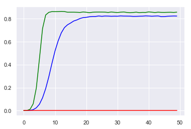
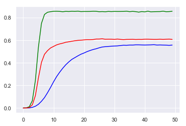

# 模型描述

## 模型描述

模型地址: [multiplex_networks.m](https://github.com/Aithosa/Epidemic-Information_spreading/blob/master/Matlab/multiplex_networks.m)

### 网络模型

双层网络，节点总数为 $N=2,000$ 其中下层为BA网络, 作为接触层模拟疾病传播;  上层网络对下层的BA网络随机增加400条边, 以保证两层网络的相关性, 作为信息层模拟疾病相关信息的传播。

### 传播模型

接触层在SIS和SIR传播模型均作了模拟:

1. 下层为SIS传播模型，上层为UAU传播模型;
2. 下层为SIR传播模型，上层为UAU传播模型。

基本策略：

下层网络代表接触层，进行疾病传播, 采用SIS传播模型： 在每个时间，易感状态节点在接触了感染状态的邻居时有$\beta$ 概率被传染为感染态节点，感染状态节点以$\mu$ 的概率会康复成为易感状态节点(SIS模型)；

上层网络代表信息层，进行疾病相关信息的传播，采用UAU传播模型：在每个时间，未知状态节点在接触了已知状态的邻居时有$\lambda$ 概率被传播为已知状态节点，已知状态节点以$\delta$ 的概率会遗忘信息成为未知状态节点；

交互规则：接触层感染状态节点会以$\alpha$ 的信息上传率，在每个时间变为信息层的已知状态节点，信息层的已知状态节点在接触层若是易感状态节点，其和其他节点接触时会携带$\sigma_{S}$ 的感染率衰减。

注：本模型U状态的节点实际表示不愿意传播关于疾病的信息，A状态的节点表示愿意传播信息。所以下层的信息上传率实际的意义是刚感染的节点在每个时间有$\alpha$ 的概率愿意在上层传播疾病相关的信息。

[参数描述]:

* $\beta$ 感染概率
* $\mu$ 恢复概率/免疫概率
* $\lambda$ 传播概率
* $\delta$ 遗忘概率

* $\alpha$ 信息上传率
* $\sigma_{S}$ S节点在知道信息后的防御系数/感染率衰减

### 原始策略描述(用活跃性描述)

在每个时间：

信息层的已知状态节点都会以 ${inactiverate}$ 的概率变为接触层的不活跃节点；
信息层的未知状态节点都会以 ${activerate}$ 的概率重新变为接触层的活跃节点。

其中：

接触层的“不活跃节点”在进行疾病传播时只会和“活跃邻居节点”接触，而不会和其他不活跃邻居节点接触；
接触层“活跃节点”则会和“所有节点”接触，不管其邻居的状态时活跃还是不活跃。

[策略参数描述]:

* ${inactiverate}$ 接触层节点变为不活跃状态的概率
* ${activerate}$ 接触层节点变为活跃状态的概率

> 注：可以设置${inactiverate} + {activerate} = 1$

### 新策略描述(用警觉性描述)

在每个时间：

信息层的已知状态节点都会以 ${activerate}$ 的概率变为接触层的警觉节点；
信息层的未知状态节点都会以 ${inactiverate}$ 的概率重新变为接触层的非警觉节点。

其中：

接触层的“警觉节点”在进行疾病传播时只会和“警觉邻居节点”接触，而不会和其他非警觉邻居节点接触；
接触层“非警觉节点”则会和“所有节点”接触，不管其邻居的状态时活跃还是不活跃。

注：这里考虑的是警觉节点平时防护性高，不管其是感染还是易感，和其接触比和未知节点接触更安全。

[策略参数描述]:

* ${activerate}$ 接触层节点变为警觉状态的概率
* ${inactiverate}$ 接触层节点变为非警觉状态的概率

> 注：可以设置${inactiverate} + {activerate} = 1$

## 目前存在的问题

当前论文采用的是警觉机制的策略(即上面第二个策略)，但是效果几乎没有(也许和参数有点关系，但效果是没有第一种策略好的)

可能的原因： 警觉节点是由A状态节点依概率来的(每个A状态的节点每个时刻都有几率变为警觉节点)，而警觉性的消失是由A节点遗忘为U节点恢复的，所以警觉性比例之比A状态比例低一点，只不过延迟几个时间。因此信息传播越广警觉节点比例就越高，在我们的初步仿真模型中占比80%多，导致在下层连通率也很高，使得效果几乎就比无策略好一点。

而采用活跃性的策略，效果则比较明显，见下面的图。因为一开始所有节点都是活跃的，而A状态的节点会以概率变为非活跃节点，非活跃节点只会和活跃节点接触，随着信息的扩散越来越广，网络中的越来越多的节点会变为非活跃节点，因此接触网络中的有效连接就会变少，从而抑制疾病的传播。

改进方向：希望可以给活跃性策略换一种更合理的对应实际生活的名字，使得可以在论文中采用活跃性的模型。

<!-- *表1 在传播过程中使用的参数。*

|参数           | 说明           |
| ------------- |:------------- |
| $\beta$             | $S_{-}$ 个体被 $I_{-}$ 邻居感染的概率($S_{-}I_{-} \rightarrow I_{-}I_{-}$)   |
| $\sigma_{S} \beta$  | $S_{+}$ 个体被 $I_{-}$ 邻居感染的概率($S_{+}I_{-} \rightarrow I_{+}I_{-}$)   |
| $\sigma_{I} \beta$  | $S_{-}$ 个体被 $I_{+}$ 邻居感染的概率($S_{-}I_{+} \rightarrow I_{-}I_{+}$)   |
| $\sigma_{SI} \beta$ | $S_{+}$ 个体被 $I_{+}$ 邻居感染的概率($S_{+}I_{+} \rightarrow I_{+}I_{+}$)   |
| $\mu$             | $I_{-}$ 个体康复为 $S_{-}$ 个体的概率  |
| $\sigma_{R} \mu$  | $I_{+}$ 个体康复为 $S_{+}$ 个体的概率  |
| $\lambda$               | 信息传输率  |
| $\delta$                | 信息遗忘率($S_{+} \rightarrow S_{-}$)  |
| $\sigma_{F} \delta$     | 信息遗忘率($I_{+} \rightarrow I_{-}$)  |
| $\alpha$     | 信息上传率($I_{-} \rightarrow I_{+}$)   |
| $K$          | S节点和已知信息的I节点接触后知晓信息的概率 | -->

## 模拟结果(采用活跃性描述)

为了方便对比，本节所有模型使用的都是相同的参数。

SIS参数： 感染率 $\beta = 0.2$ , 恢复率/免疫率$\mu = 0.1$

UAU参数: 传播率$\lambda = 0.4$, 遗忘率$\delta = 0.15$

策略参数： 节点不活跃概率${inactiverate} = 0.4$, 活跃概率${activerate} = 0.6$

层间交互参数： 信息上传率$\alpha = 0.6$, 感染率衰减$\sigma_{S} = 0.7$

### SIS-UAU

当没有加入策略时，${inactiverate} = 0$ ， ${activerate} = 1$ ，其他参数不变。

图2(图3)注： 

* 绿色曲线代表知情节点密度
* 蓝色曲线代表感染节点密度
* 红色曲线代表不活跃节点密度

加入策略的结果：

